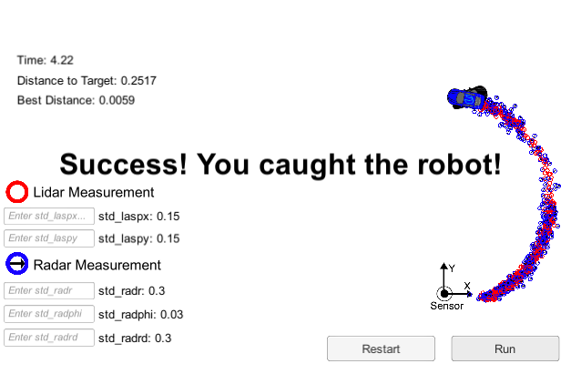
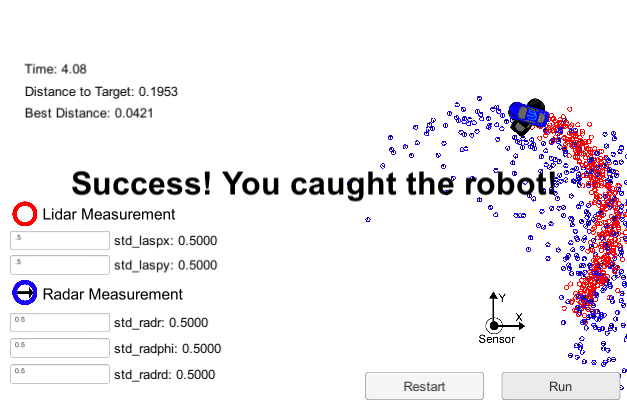

# Run Away Robot with Unscented Kalman Filter Bonus Challenge Starter Code
Self-Driving Car Engineer Nanodegree Program

---

### Overview

This project uses an Unscented Kalman Filter (UKF) to enable an autonomous "pursuit" car to track and intercept a "Run Away Car". The code runs in the Udacity Term 2 Simulator which can be downloaded [here](https://github.com/udacity/self-driving-car-sim/releases). The starting repo is [here](https://github.com/colinmccormick/CarND-Catch-Run-Away-Car-UKF).

### Using a UKF to track a vehicle

In the simulation, the run-away car moves along a steady circular path at a constant speed. There are frequent lidar and radar "measurements" of the position and heading of the run-away car that are fed to the pursuit car. These are noisy, and so they have to be processed by a UKF to integrate them into a highly accurate estimation of the current true state of the run-away car. This is very similar to real-world autonomous vehicles, which must integrate data from multiple sensors, all of which is noisy to some degree, in tracking various objects. The UKF implemented here is the same as the one I developed for the Udacity [Unscented Kalman Filter project](https://github.com/colinmccormick/CarND-Unscented-Kalman-Filter-Project).

### Pursuing a moving vehicle

A key feature of the project is steering the pursuit car to intercept the run-away car. But steering toward where it curently is - as determined by the UKF - won't work, because by the time the pursuit car arrives the run-away car will have moved on. That means the pursuit strategy needs to use the UKF's capability to predict the future position of the run-away car, and use that as a target for pursuit steering. To complicate matters, the pursuit car has the same speed as the run-away car, so it can't just step on the accelerator to catch up.

To solve this problem, I used a series of successively refined estimates of the time when the two cars could cross paths. The refinement occurs once for every pair of lidar/radar measurements. To calculate it, I first calculate the time it would take the pursuit car to reach the position where the run-away car currently is. Since the run-away car is moving mostly away from the pursuit car, it will actually take longer to intercept it. I scale this "naive intercept time" by an "overshoot" factor, which is initialized to 1.25 at the first measurement. I then use the UKF to predict where the run-away car will be at this later, scaled time. Finally, I calculate how long it will take the pursuit car to reach that new, predicted position. Based on whether that final time value is larger or smaller than the scaled naive intercept time, I adjust the overshoot factor for the next measurement iteration.

This approach quickly converges and produces a successful interception. After some initial jittery motion by the pursuit car - mostly the result of the UKF not yet having gathered enough measurements to be able to make good future state predictions - the pursuit car settles into a steady, straight trajectory that successfully intercepts the run-away car after approximately 4-5 seconds.

The algorithm is also successful for larger noise values - the largest noise values for which it successfully runs is 3.3 times larger than the default for the lidar noise, and 1.7 times larger for the radar noise (I didn't exhaustively test these parameters).

### Running the Code

This repository includes two files that can be used to set up and intall uWebSocketIO for either Linux or Mac systems. For windows you can use either Docker, VMware, or even Windows 10 Bash on Ubuntu to install uWebSocketIO.

Once the install for uWebSocketIO is complete, the main program can be built and ran by doing the following from the project top directory.

`mkdir build && cd build`

`cmake .. && make` 

`./UnscentedKF`

Note that the programs that need to be written to accomplish the project are `src/ukf.cpp`, `ukf.h`, and `main.cpp` which will use some strategy to catch the car, just going to the cars current esimtated position will not be enough since the capture vehicle is not fast enough. There are a number of different strategies you can use to try to catch the car, but all will likely involve predicting where the car will be in the future which the UKF can do. Also remember that the run away car is simplifying moving a circular path without any noise in its movements.

Here is the main protocol that `main.cpp` uses for uWebSocketIO in communicating with the simulator.

**INPUT**: values provided by the simulator to the C++ program

// current noiseless position state of the capture vehicle, called hunter

["hunter_x"]

["hunter_y"]

["hunter_heading"]

// get noisy lidar and radar measurements from the run away car.

["lidar_measurement"]

["radar_measurement"]

**OUTPUT**: values provided by the c++ program to the simulator

// best particle values used for calculating the error evaluation

["turn"] <= the desired angle of the capture car "hunter" no limit for the angle

["dist"] <= the desired distance to move the capture car "hunter" can't move faster than run away car

## Dependencies

* cmake >= v3.5
* make >= v4.1
* gcc/g++ >= v5.4
* uWebSocketIO

## Basic Build Instructions

1. Clone this repo.
2. Make a build directory: `mkdir build && cd build`
3. Compile: `cmake .. && make`
4. Run it: `./UnscentedKF` 
